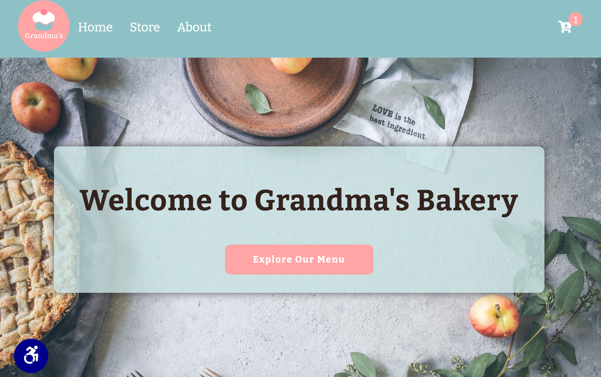

# Cake Store - Update
**This project is live here: [Project](https://christinajackson.github.io/cakeStore-update/)**

## Description
I coordinated the original version of this project because I wanted to gain experience developing collaboratively. I reached out to someone who I thought would be willing to participate. The current image is of the project after I did some redesign work.

## Project Brief
### Goal
Build a mock store front page. 

### My Contributions
On the original version I built the image grid, developed the high contrast mode for color accessibility, applied flex-box layout features to the header and footer as well as designing the footer. I added the filter on the products page as well as the feature to click out of cart area to close cart. Improved the positioning and design of color accessibility button. 

#### Partners Contributions
Implemented and adapted code for the cart from a tutorial found here: [Tutorial]("https://www.youtube.com/watch?v=023Psne_-_4)

## Features to be Added

- Unit tests
- Build with React
- Animation on add to cart

## Technologies
- JavaScript 
- HTML
- CSS
- Trello
- Slack

## Running the Project Locally

**Installation and Usage:**
1. Clone the project
    - To clone this project, follow these instructions: [GitHub Documentation](https://docs.github.com/en/free-pro-team@latest/github/creating-cloning-and-archiving-repositories/cloning-a-repository)
2. Make sure you have Node.js downloaded: 
    - In the command line(CMD) `node -v`
    - If not you can download it here [Node.js](https://nodejs.org/en/download/)
3. In CMD run
     - `npm install http-server -g`
4. Navigate to the project folder in the CMD and run
    - `http-server`
    - This will start a local server
    - Copy the http address listed in the command line and paste into your browser
    - Run the index.html file to start the app

**Alternatively**
- After cloning the project in step 1, you can use the Live Server extension in VSCode to run the project from the index.html file. [Extension](https://marketplace.visualstudio.com/items?itemName=ritwickdey.LiveServer)

